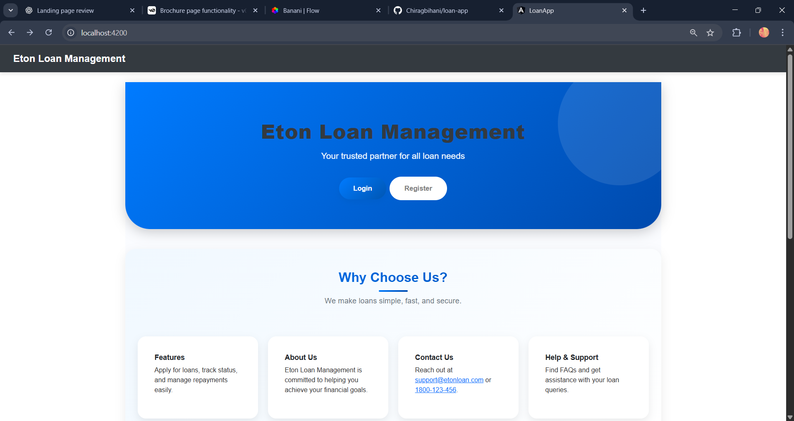
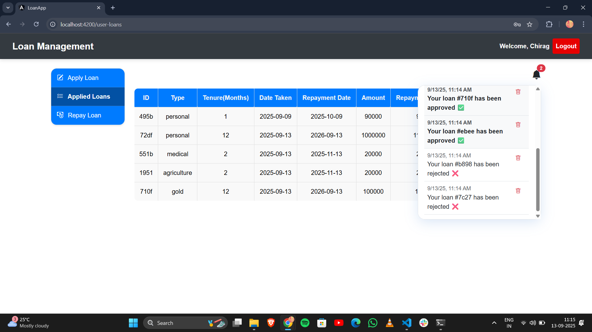
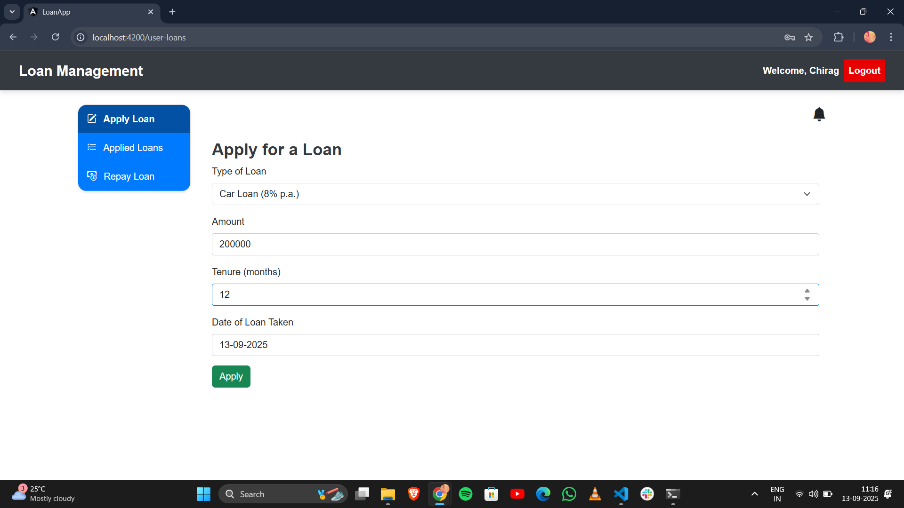
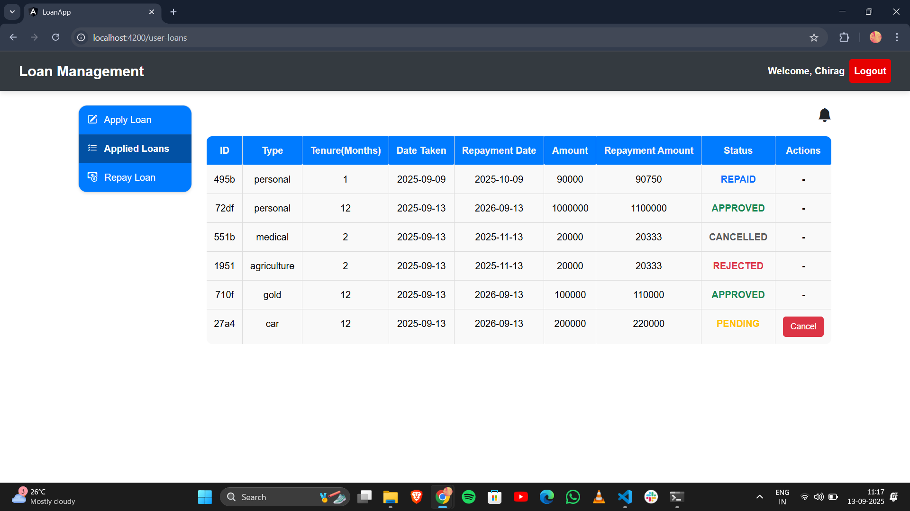
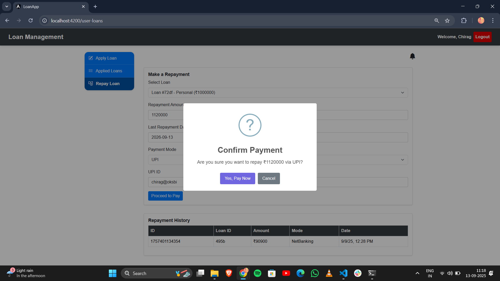
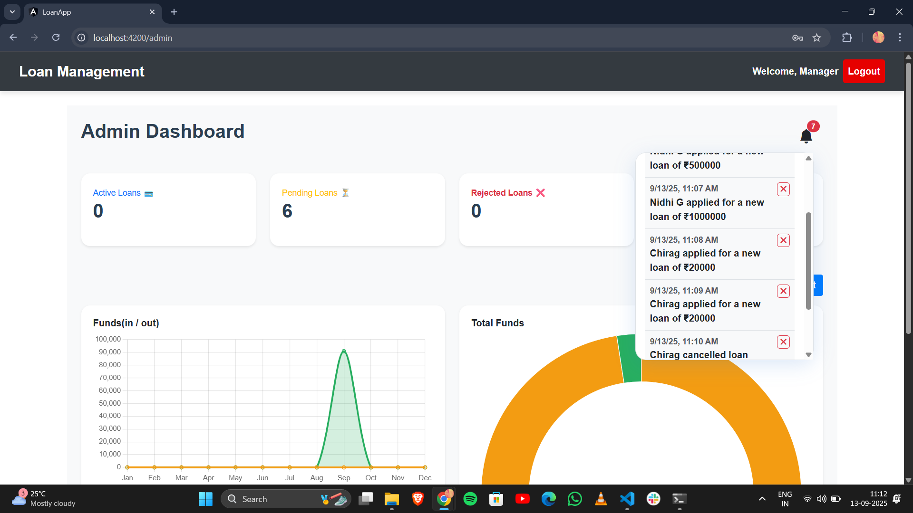

# 📌 Loan Management System (Angular + JSON Server)

A role-based loan management system built with **Angular** and **JSON Server**.  
It allows **customers** to register, log in, and apply for loans, while **managers (admins)** can review, approve, reject, or move loans back to pending.  

---

## 🚀 Features

### 👤 Customer (User)
- Register & Login  
- Apply for a new loan  
- View all previous loans with status (`Pending`, `Approved`, `Rejected`, `Cancelled`,`Repaid`)  
- Cancel a loan request if it is still pending
- Repay a loan once approved.
- Gets the notifcation of the Loan approved or Cancelled

### 👨‍💼 Manager (Admin)
- Login with admin credentials  
- View all **Pending**, **Approved**, **Repaid** and **Rejected** loans in separate tabs  
- Approve or Reject loan requests  
- Move rejected loans back to **Pending** if documents are corrected  
- Full control over all customers' loan requests
- See the chart viusalization for the funds.
- Download the complete report.
- Gets Notifcation of the any new loan or cancelled or repaid loan.

---

## 🛠️ Tech Stack
- **Frontend**: Angular 14+  
- **Backend (Mock API)**: JSON Server  
- **Storage**: LocalStorage (for session handling)  
- **Styling**: Bootstrap + Angular Material  

---

## ⚙️ Installation & Setup

### 1. Clone the Repository
```bash
git clone https://github.com/Chiragbihani/loan-app
cd loan-app
```

### 2. Install Dependencies
```bash
npm install
```
### 3. Setup JSON Server
Create a file named db.json in the project root:
```bash
{
  "users": [
    {
      "id": 1,
      "fullName": "Manager",
      "email": "admin@example.com",
      "password": "admin123",
      "role": "admin"
    }
  ],
  "loans": []
}
```
Start JSON Server:
```bash
npx json-server --watch db.json --port 3000
```
Server will run at:
👉 http://localhost:3000/

### 4. Run Angular Project
```bash
ng serve
```
Frontend will be available at:
👉 http://localhost:4200/

## 🔑 Default Credentials

- Admin Login
- Email: admin@example.com
- Password: admin123
- New Users
- Can register via the /register page
- Automatically assigned role: "user"

## 📸 Screenshots

### 🏠 Landing Page


### 👤 User Dashboard


## Apply Loan

## Applied Loan

## Repay Loan


### 👨‍💼 Admin Dashboard


### 📊 Loan Reports


## Project Structure
```bash
src/
 ├── app/
 │   ├── components/
 │   │   ├── login/
 │   │   ├── register/
 │   │   ├── home/
 │   │   ├── user-loans/
 │   │   ├── admin-dashboard/
 │   │   ├── apply-loan/
 │   │   └── landing-page/              
 │   ├── services/
 │   │   ├── auth.service.ts
 │   │   ├── loan.service.ts
 │   │   └── notification.service.ts    
 │   ├── guards/
 │   │   ├── auth.guard.ts
 │   │   └── admin.guard.ts
 │   └── app-routing.module.ts
 ├── assets/                           
 └── db.json

```
## Contribution
Pull requests are welcome. Please open an issue first to discuss what you would like to change.
## 📜 License

This project is licensed under the MIT License.
